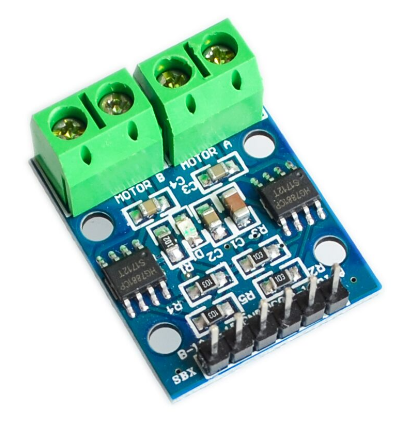
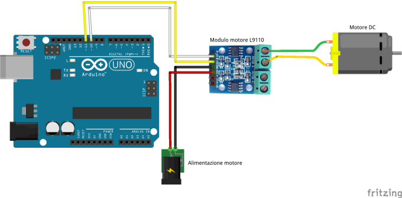
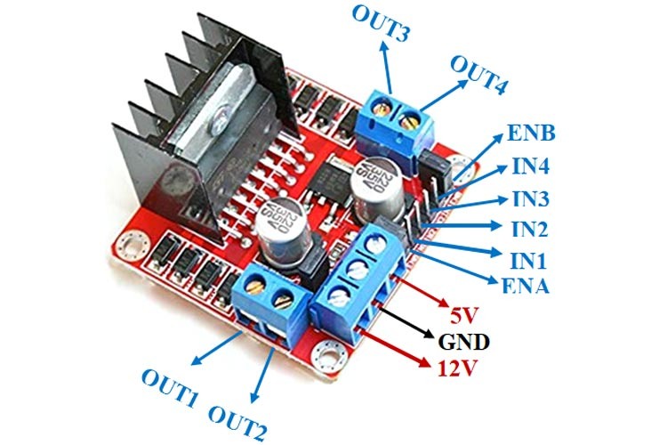

Comandare un motore DC con Hbridge
==================================

.. contents:: Indice
  :depth: 1
  :local:

Schema di montaggio con un motore
******************************************

Pagina web con datasheet_ ed esempio di utilizzo.
Informazioni dettagliate anche qui_ (modello meno compatto L298N).

Il listato seguente comanda un motore DC collegato ai pin 12 e 11::

 /***  Istruzioni per comandare un motore DC - senza regolazione di velocità in PWM   ***/

  void setup()
  {
  pinMode(12,OUTPUT);
  pinMode(11,OUTPUT);
 }

 void loop()
 {
    digitalWrite(12,LOW);
    digitalWrite(11,LOW);
    delay(1000);
    digitalWrite(12,HIGH);
    digitalWrite(11,LOW);
    delay(1000);
    digitalWrite(12,LOW);
    digitalWrite(11,HIGH);
    delay(1000);
   }

::

  /***  Istruzioni per comandare un motore DC - con regolazione velocità in PWM   ***/
  
   void setup()
   {
   pinMode(10,OUTPUT);
   pinMode(11,OUTPUT);
  }

  void loop()
  {
     digitalWrite(11,LOW);
     digitalWrite(10,LOW);
     delay(2000);
     digitalWrite(11,HIGH);
     analogWrite(10,5);
     delay(1000);
     digitalWrite(11,HIGH);
     analogWrite(10,50);
     delay(1000);
     digitalWrite(11,LOW);
     analogWrite(10,200);
     delay(1000);
     digitalWrite(11,LOW);
     analogWrite(10,250);
     delay(1000);
    }

.. _datasheet: http://www.adrirobot.it/motor_driver/L9110_HG7881/motor_driver_L9110-HG7881.htm
.. _qui: https://components101.com/modules/l293n-motor-driver-module
