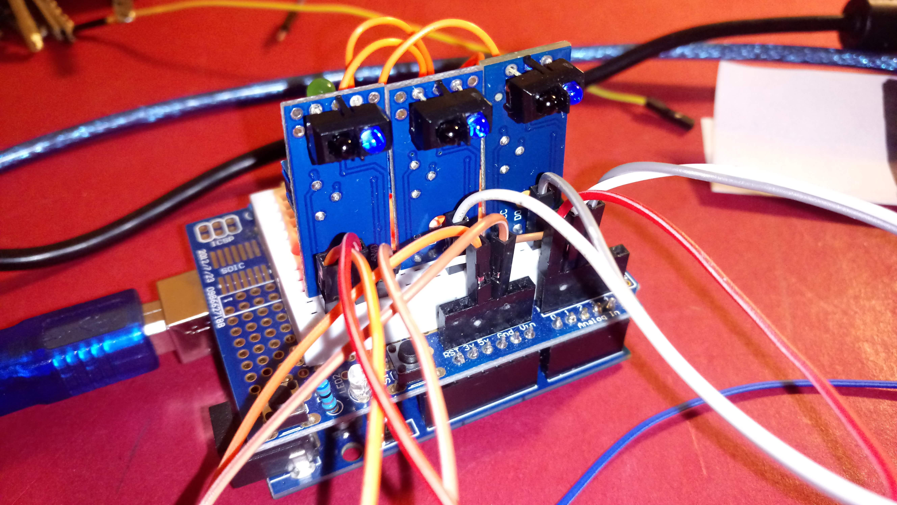

Realizzare un segui-linea con ricevitore IR (infrarosso)
========================================================

.. contents:: Indice
  :depth: 1
  :local:

Schema di montaggio di emettitore/ricevitore IR
***********************************************

`Questa è la pagina web <https://www.buildcircuit.com/test-your-sensors-for-line-following-robots/>`_ presa a riferimento.

Il listato seguente esegue la lettura dei valori analogici inviati dai ricevitori IR (è l'esempio AnalogReadSerial modificato)::

    int ledPIN= 9;
    // the setup routine runs once when you press reset:
    void setup() {
      // initialize serial communication at 9600 bits per second:
      Serial.begin(9600);
      pinMode(ledPIN, OUTPUT);
    }
    // the loop routine runs over and over again forever:
    void loop() {
      digitalWrite(ledPIN,HIGH);
      // read the input on analog pin 0:
      int sensorValue_A0= analogRead(A0);
      int sensorValue_A1 = analogRead(A1);
      int sensorValue_A2 = 0;
      // print out the value you read:
      Serial.println(sensorValue_A0);
      Serial.println(sensorValue_A1);
      Serial.println(sensorValue_A2);
      delay(500);        // delay in between reads for stability
    }

.. note::
 :download:`File Fritzing .fzz del progetto <./files/IRemettitore>`

Emettitore/ricevitore IR su PCB preassemblato
*********************************************

Volendo semplificare i collegamenti esistono pcb già montati con i led necessari. I collegamenti e i valori letti sono identici a quelli sopra descritti.

