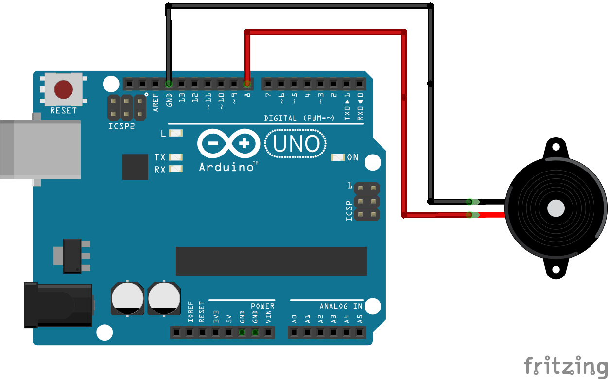
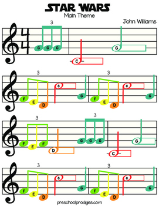

Suonare melodie con Arduino
==================================

.. contents:: Indice
  :depth: 1
  :local:

Schema di collegamento
*********************************

Tutorial ufficiali che hanno ispirato il seguente esercizio: suona nota singola_ e multipla_ .
Esempi si trovano anche nel menu ``File->Esempi->Digital``.

Il programma utilizzo due semplici istruzioni::

  tone(8, 175, 250);  // dove i numeri stanno per (pin collegato, frequenza della nota, durata in millisecondi)
  delay(250);         // arresta l'esecuzione per la durata della nota che altrimenti risulterebbe troncata dall'inizio della successiva

Ecco l'inizio del tema musicale di Star Wars::

  /*
  Single tone player
  Ispirato da
  http://arduino.cc/en/Tutorial/Tone4
  */
  
  void setup(){
  }

  void loop(){			
  // play a note on pin 6 for 200 ms:
  tone(6,196, 250);
  delay(250);
  tone(6, 196, 250);
  delay(250);
  tone(6, 196, 250);
  delay(250);

Il tema che trovi qui ha note di due sole durate, 250 e 500. Prova a comporre la musica ed eseguirla.

Ogni nota ha una frequenza ben precisa, ecco quelle che potrebbero servire::

  #define NOTE_C3  131 // do
  #define NOTE_CS3 139 // do#
  #define NOTE_D3  147 // re
  #define NOTE_DS3 156
  #define NOTE_E3  165 // mi
  #define NOTE_F3  175 // fa
  #define NOTE_FS3 185 
  #define NOTE_G3  196 // sol
  #define NOTE_GS3 208
  #define NOTE_A3  220 // la
  #define NOTE_AS3 233
  #define NOTE_B3  247 // si
  #define NOTE_C4  262 // do
  #define NOTE_CS4 277
  #define NOTE_D4  294 // re
  #define NOTE_DS4 311
  #define NOTE_E4  330 // mi
  #define NOTE_F4  349 // fa
  #define NOTE_FS4 370
  #define NOTE_G4  392 // sol
  #define NOTE_GS4 415
  #define NOTE_A4  440 // la (diapason)
  #define NOTE_AS4 466 
  #define NOTE_B4  494 // do

.. _singola: https://www.arduino.cc/en/Tutorial/ToneMelody?from=Tutorial.Tone
.. _multipla: https://www.arduino.cc/en/Tutorial/ToneMultiple?from=Tutorial.Tone4