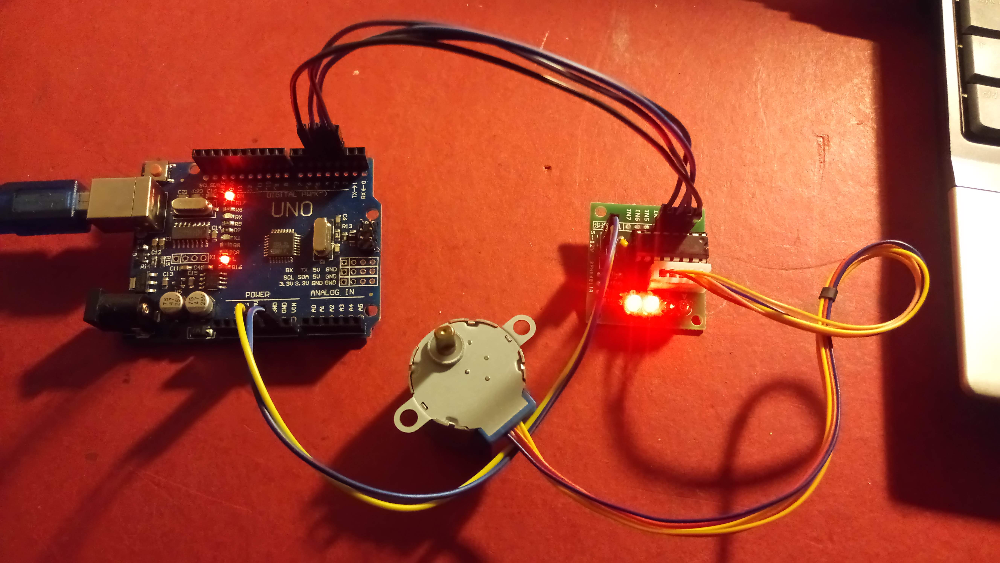

Comandare un motore stepper modello 28BYJ
========================================================

.. contents:: Indice
  :depth: 1
  :local:

Schema di montaggio di emettitore/ricevitore IR
***********************************************

.. note::
    Siti con esempi da provare e breve spiegazione:
    
    `Guida Stepper.h sito Arduino <https://www.arduino.cc/en/Tutorial/StepperOneRevolution>`_
    
    `Esempio con comandi manuali <https://aspettandoilbus.blogspot.com/2014/09/collegare-il-motore-passo-passo-28byj.html>`_
    
    `Esempio con classe <http://pontech.altervista.org/arduino-tutorial-2-pilotare-step-motor-28byj-48-arduino/>`_

