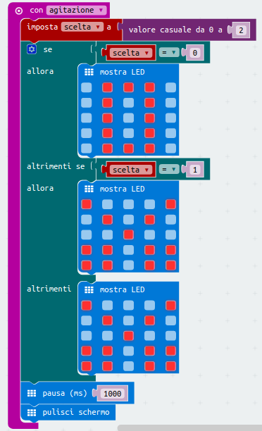

Carta Forbici Sasso
===================

Fase 1
++++++

Posiziona il blocco ``Ingresso -> con agitazione``.

Fase 2
++++++

Crea una ``variabile`` utilizzando il blocco imposta, che contengano un valore casuale scelto tra tre valori (0-1-2), usando il blocco ``Matematica -> valore casuale tra 0 e 2.

