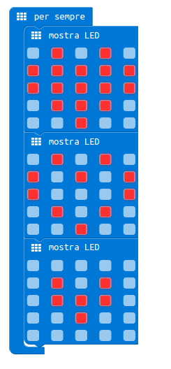
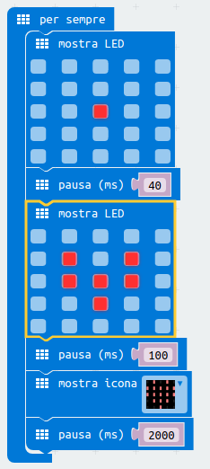
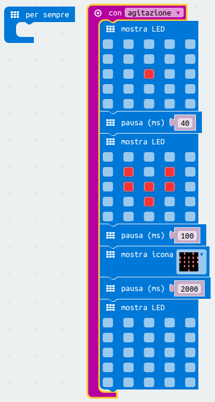

Cuore Lampeggiante
===================

Fase 1
++++++

Posiziona il blocco ``Fondamentali-> mostra LED`` all’interno del blocco ``per sempre``.

.. image:: ./images/menufondamentali.png

Fase 2
++++++

Disegna una serie di tre cuori.

Fase 2
++++++

Prova ad inserire una pausa tra un'immagine e l'altra.

Attiva l'immagine solo se Micro:Bit viene scosso. L'agitazione è un tipo di input che trovi nel menu ``Ingressi``.

