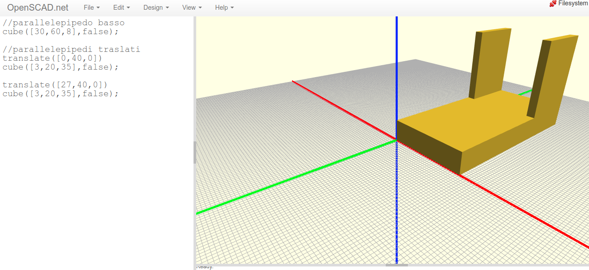
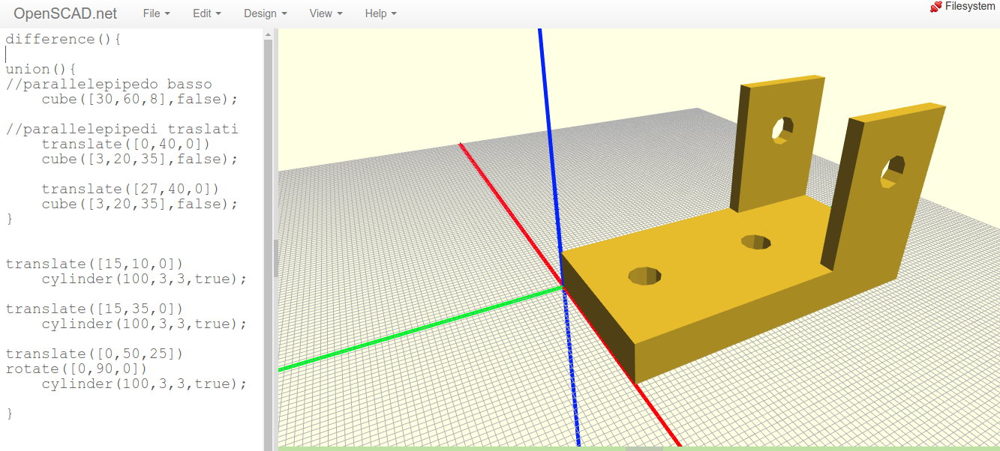

Esempi
======

.. contents:: Indice
  :depth: 1
  :local:

Solido composto da parallelepipedi
**********************************

Di seguito un esempio di solido composto da tre parallelepipedi rettangoli.

::

  //parallelepipedo basso
    cube([30,60,8],false);

  //parallelepipedi traslati
    translate([0,40,0])
    cube([3,20,35],false);

    translate([27,40,0])
    cube([3,20,35],false);

Solido composto con fori
*************************

Il solido dell'esempio precedente con l'aggiunta di fori. Leggere i commenti alle istruzioni per chiarimenti.

::

  difference(){

  //è necessario unire i due solidi cube altrimenti difference() utilizzerebbe anche il secondo per eseguire le sottrazioni
  union(){
  //parallelepipedo basso
  cube([30,60,8],false);

  //parallelepipedi traslati
  translate([0,40,0])
    cube([3,20,35],false);

  translate([27,40,0])
    cube([3,20,35],false);
    }

  // foro verticali nella base
  translate([15,10,0])
    cylinder(100,3,3,true);
  // foro verticali nella base
  translate([15,35,0])
    cylinder(100,3,3,true);

  //fori orizzontali nelle due ali verticali
  //essendo abbastanza lungo il cilindro trapassa entrambe
  translate([0,50,25])
  rotate([0,90,0])
    cylinder(100,3,3,true);

  }

