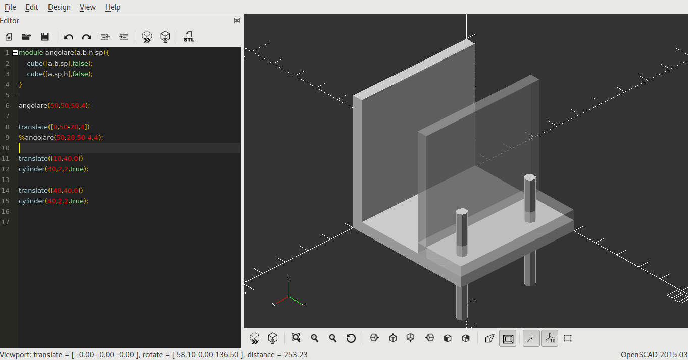
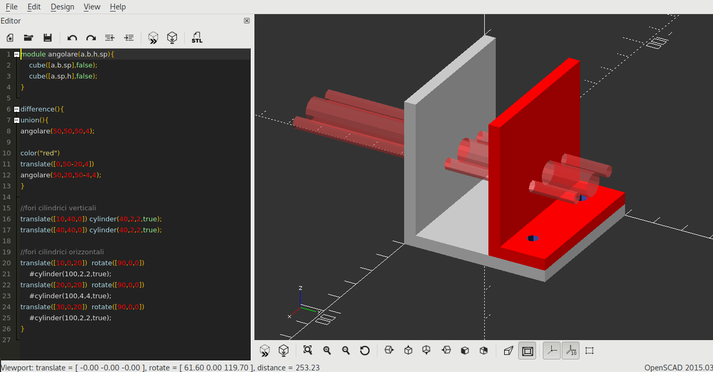

Esempi
======

.. contents:: Indice
  :depth: 1
  :local:

Solido composto da parallelepipedi
**********************************

Di seguito un esempio di solido composto da tre parallelepipedi rettangoli.

::

  //parallelepipedo basso
    cube([30,60,8],false);

  //parallelepipedi traslati
    translate([0,40,0])
    cube([3,20,35],false);

    translate([27,40,0])
    cube([3,20,35],false);

.. image:: ./images/parallelepipedi_composizione.png

Solido composto da parallelepipedi con fori
*******************************************

Il solido dell'esempio precedente con l'aggiunta di fori. Leggere i commenti alle istruzioni per chiarimenti.

::

  difference(){

  //è necessario unire i due solidi cube altrimenti difference() utilizzerebbe anche il secondo per eseguire le sottrazioni
  union(){
  //parallelepipedo basso
  cube([30,60,8],false);

  //parallelepipedi traslati
  translate([0,40,0])
    cube([3,20,35],false);

  translate([27,40,0])
    cube([3,20,35],false);
    }

  // foro verticali nella base
  translate([15,10,0])
    cylinder(100,3,3,true);
  // foro verticali nella base
  translate([15,35,0])
    cylinder(100,3,3,true);

  //fori orizzontali nelle due ali verticali
  //essendo abbastanza lungo il cilindro trapassa entrambe
  translate([0,50,25])
  rotate([0,90,0])
    cylinder(100,3,3,true);

  }

.. image:: ./images/esempio_staffaConFori.png

Modello composto usando pezzi ripetitivi: module()
**************************************************

Se un modello è composto da parti identiche o simili è possibile definire un ``module``, una procedura/funzione che contenga le istruzioni per la modellazione e che può essere richiamata quando necessario, ciò riduce la lunghezza del codice e lo rende più leggibile.

Il modello che segue è realizzato usando Openscad installato in locale e non la web-app Openscad.net usata in precedenza. Il simbolo di percentuale ``%`` rende il solido trasparente per migliorare la visualizzazione del modello in fase questa fase di progettazione.

::

  //il modulo angolare accetta 4 parametri che ne definiscono la geometria
  module angolare(a,b,h,sp){
    cube([a,b,sp],false);
    cube([a,sp,h],false);
    }

  //prima chiamata al modulo per la creazione della base
  angolare(50,50,50,4);

  //seconda chiamata al modulo per la creazione del secondo angolare
  translate([0,50-20,4])
  %angolare(50,20,50-4,4);

  translate([10,40,0])
  cylinder(40,2,2,true);

  translate([40,40,0])
  cylinder(40,2,2,true);

Per realizzare il pezzo correttamente forato bisognerà utilizzare i comandi ``difference()`` e ``union()``.
Nel listato che segue:
* ``color("red")`` serve a migliorare la visualizzazione
* ``%`` dona trasparenza al pezzo di base
* ``#`` evidenzia i cilindri orizzontali
Altri modificatori esistenti, ed utili durante la fase di debug, sono:
* ``!`` per evidenziare unicamente il solido preceduto da questo simbolo
* ``*`` per escludere dalla visualizzazione il solido preceduto da questo simbolo

