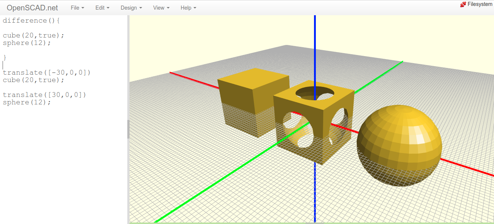
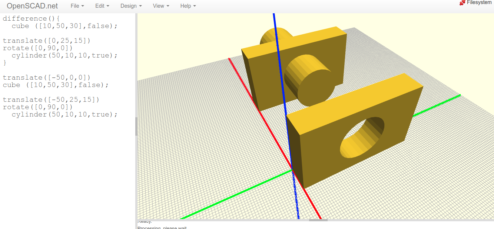
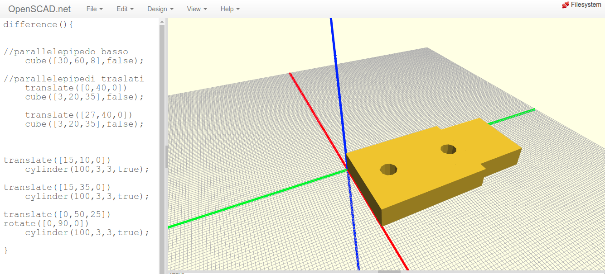

Operazioni booleane: somma e sottrazione di solidi
==================================================

.. contents:: Indice
  :depth: 1
  :local:

Realizzazione di vuoti con il modificatore: difference()
********************************************************

Per realizzare fori o svuotare solidi si utilizza il metodo modificatore ``difference()``.
Le parentesi graffe {...} contengono i solidi che si vuole combinare. Dal primo solido vengono sottratti quelli che seguono.

::

  difference(){
    cube(20,true);
    sphere(12);
    }

  translate([-30,0,0])
  cube(20,true);

  translate([30,0,0])
  sphere(12);

Per esempio, per realizzare fori circolari in una piastra eseguire una differenza tra un solido ``cube`` ed un ``cylinder`` opportunamente ruotato e traslato.

::

  difference(){
  cube ([10,50,30],false);

  translate([0,25,15]) rotate([0,90,0])
    cylinder(50,10,10,true);
  }

  translate([-50,0,0])
    cube ([10,50,30],false);

  translate([-50,25,15]) rotate([0,90,0])
    cylinder(50,10,10,true);

Unione tra solidi mediante il modificatore: union()
********************************************************

Per eseguire differenze tra gruppi di solidi talvolta è necessario utilizzare ``union()``. Nell'esempio seguente i parallelepipedi vengo uniti per poter eseguire i fori; senza l'unione tra i primi due ``cube`` si otterrebbe una differenza tra il primo solido e tutto ciò che segue, come mostrato più in basso.

::

  difference(){

  //è necessario unire i due solidi cube altrimenti difference() utilizzerebbe anche il secondo per eseguire le sottrazioni
  union(){
  //parallelepipedo basso
  cube([30,60,8],false);

  //parallelepipedi traslati
  translate([0,40,0])
    cube([3,20,35],false);

  translate([27,40,0])
    cube([3,20,35],false);
    }

  // foro verticali nella base
  translate([15,10,0])
    cylinder(100,3,3,true);
  // foro verticali nella base
  translate([15,35,0])
    cylinder(100,3,3,true);

  //fori orizzontali nelle due ali verticali
  //essendo abbastanza lungo il cilindro trapassa entrambe
  translate([0,50,25])
  rotate([0,90,0])
    cylinder(100,3,3,true);

  }

.. image:: ./images/esempio_staffaConFori.png

Risultato del modello eseguito senza utilizzo del modificatore ``union``.

