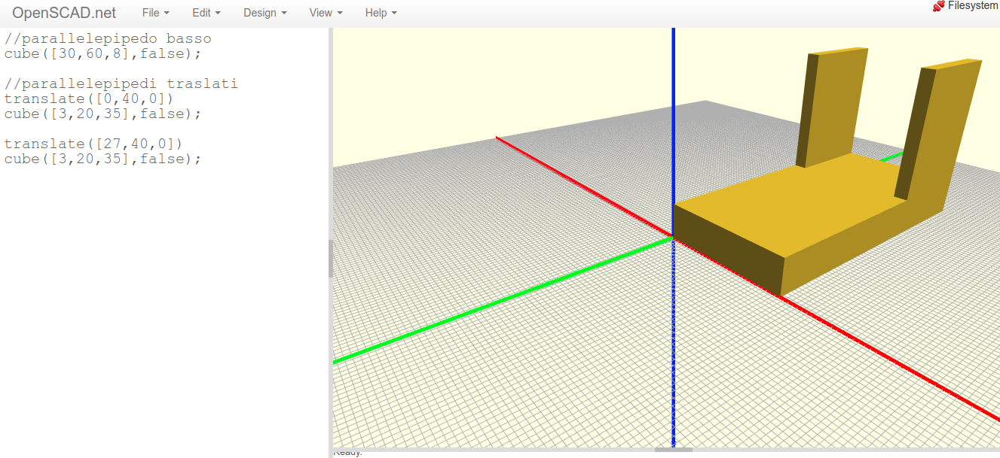

Parallelepipedi e solidi composti
=================================

.. contents:: Indice
  :depth: 1
  :local:

Parallelepipedo rettangolo
**************************

I cubi ed i parallelepipedi rettangoli si creano con l'istruzione ``cube``. Il valore finale ``true`` o ``false`` determina una differente posizione rispetto all'origine.

::

  cube([10,20,35],true);

::

  cube([10,20,35],false);

Un cubo può essere realizzato sostituendo il vettore ``[10,20,35]`` con il singolo valore del lato i.e. ``10``.

::

  cube(10,false);

Traslazione di un solido
************************

La traslazione avviene anteponendo il comando ``translate`` al comando solido ``cube``.

::

 //parallelepipedo basso
  cube([10,20,5],false);

 //parallelepipedo traslato
  translate([10,20,0])
    cube([10,20,35],false);

Esempio di un solido composto
*****************************

Di seguito un esempio di solido composto da tre parallelepipedi rettangoli.

::

  //parallelepipedo basso
    cube([30,60,8],false);

  //parallelepipedi traslati
    translate([0,40,0])
    cube([3,20,35],false);

    translate([27,40,0])
    cube([3,20,35],false);

