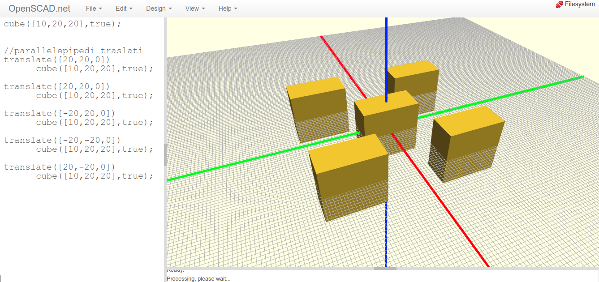
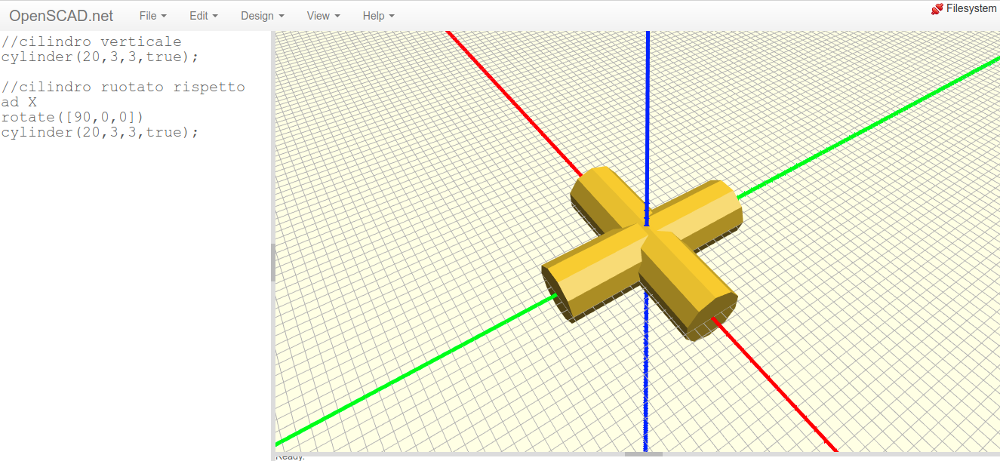
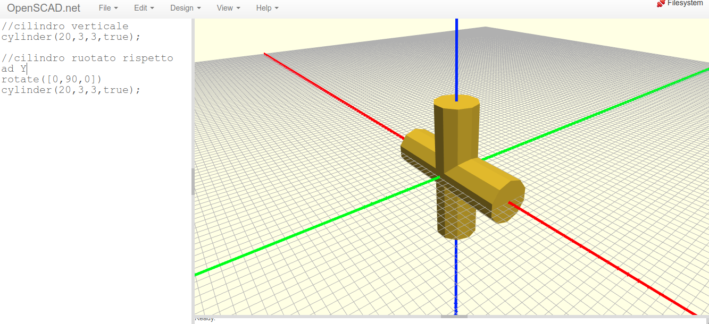
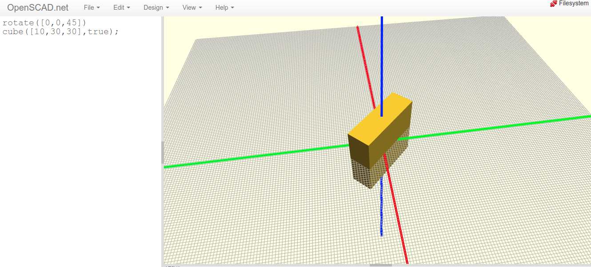
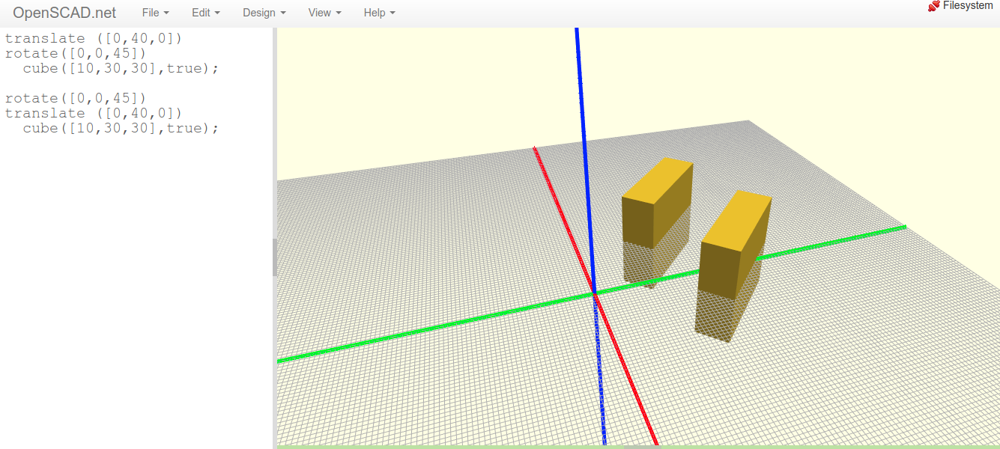

Traslazione e rotazione
=======================

.. contents:: Indice
  :depth: 1
  :local:

Traslazione di un solido
************************
La traslazione avviene anteponendo il comando ``translate[x,y,z]`` al solido da ruotare. La lista di valori racchiusi tra parentesi quadre rappresentano le quantità di traslazione lungo i tre assi rispettivamente.

::

    cube([10,20,20],true);

    //parallelepipedi traslati
    translate([20,20,0])
          cube([10,20,20],true);

    translate([20,20,0])
          cube([10,20,20],true);

    translate([-20,20,0])
          cube([10,20,20],true);

    translate([-20,-20,0])
          cube([10,20,20],true);

    translate([20,-20,0])
          cube([10,20,20],true);

Rotazione di un solido
**********************

La rotazione avviene anteponendo il comando ``rotate[x,y,z]`` al solido da ruotare. La lista di valori racchiusi tra parentesi quadre rappresentano le quantità di rotazione in gradi lungo i tre assi rispettivamente.

Rotazione intorno ad X::

  //cilindro verticale
  cylinder(20,3,3,true);

  //cilindro ruotato rispetto ad X
  rotate([90,0,0])
    cylinder(20,3,3,true);

Rotazione intorno ad Y::

  //cilindro verticale
  cylinder(20,3,3,true);

  //cilindro ruotato rispetto ad X
  rotate([0,90,0])
    cylinder(20,3,3,true);

Rotazione intorno a Z::

  rotate([0,0,45])
    cube([10,30,30],true);

Combinazione di traslazione e rotazione consicutive. Fare attenzione all'ordine in cui si inserisco rotazione e traslazione; viene eseguita per prima la trasformazione più vicina al comando solido con la conseguenza che invertire le operazioni porta a risultati differente come mostrato in figura::
  
  translate ([0,40,0])
  rotate([0,0,45])
    cube([10,30,30],true);

  rotate([0,0,45])
  translate ([0,40,0])
    cube([10,30,30],true);

