Come utilizzare un Joypad con Scratch
=====================================

Preparare variabili, liste e valori costanti (le carte)
-------------------------------------------------------

#. CREA LE **VARIABILI** E LE **LISTE** NECESSARIE AL PROGETTO SCRATCH.

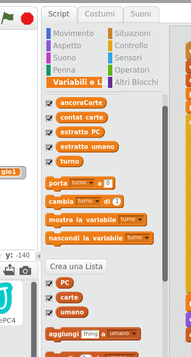

#. E INSERISCI IL **CODICE** CHE ALL’INIZIO LE INIZIALIZZA A ZERO.

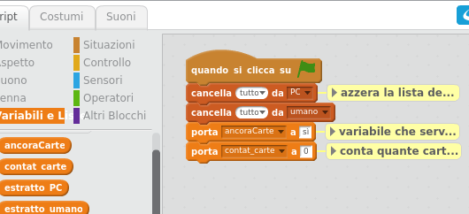

#. LA **LISTA CARTE** VA COMPILATA A MANO CON LE 10 CARTE USANTE NEL GIOCO.

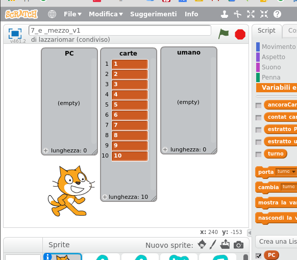

Creare il codice che estrae  memorizza le carte
-----------------------------------------------

#. USANDO IL BLOCCO **RIPETI FINO A QUANDO**, IL GIOCO PROCEDE E VENGONO ESTRATTE DUE CARTE: UNA PER IL PC E UNA PER IL **GIOCATORE**.
IL NUMERO ESTRATTO VIENE SALVATO NELLE VARIABILI (AD OGNI TURNO IL NUOVO VALORE ESTRATTO SOSTITUISCE IL VECCHIO).

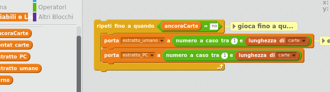

#. I VALORI ESTRATTI VENGONO LETTI USANDO IL COMANDO **DIRE** ED I VALORI VENGONO SALVATI NELLA **LISTA** CHE CONTIENE TUTTE LE CARTE ESTRATTE DEI GIOCATORI.

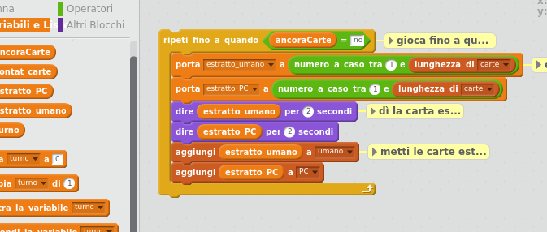

#. LA VARIABILE **CONTAT_CARTE** È UN CONTATORE PER RICORDARE QUANTE CARTE SONO STATE ESTRATTE E SERVIRÀ A FAR APPARIRE LA n-ESIMA CARTA DEL MAZZO.

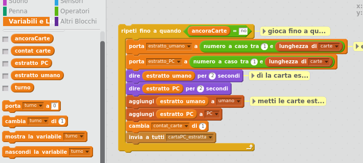

#. AL TERMINE DELLA MANO IL PROGRAMMA CHIEDE AL GIOCATORE SE VUOLE ANCORA UNA CARTA. SE PENSA DI AVER VINTO RISPONDE **NO** E VERRÀ ESTRATT ANCORA UNA SOLA CARTA PER IL GIOCATORE **PC** CHE A QUESTO PUNTO AVRÀ VINTO O PERSO, MA VERIFICARSI ANCHE UN PAREGGIO...

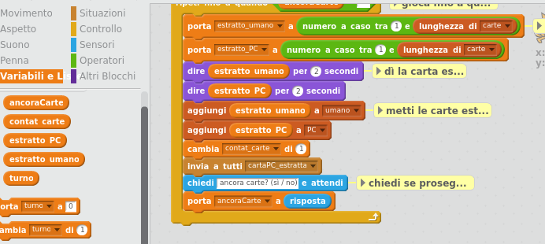

#. AGGIUNGERE I COMANDI PER L’ULTIMA ESTRAZIONE ALDIFUORI DEL CICLO **RIPETI FINO A QUANDO**.

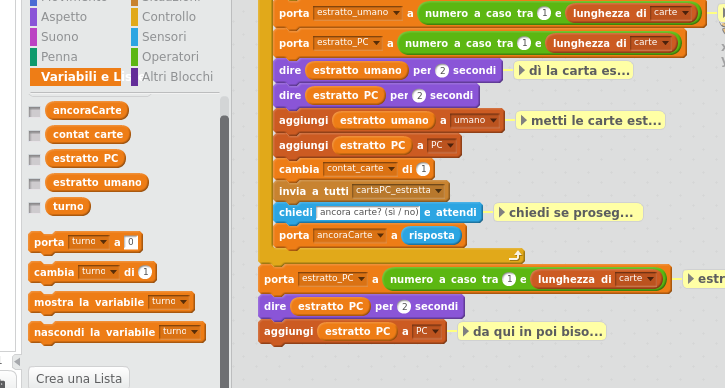

Creare le carte e gestire la loro comparsa
------------------------------------------

#. CREARE UNO SPRITE CON **10 COSTUMI** ED IL CODICE PER FAR APPARIRE LA CARTA GIUSTA (vedi la prossima slide) E SOLO AL TERMINE DUPLICHIAMO 5 VOLTE LO SPRITE.

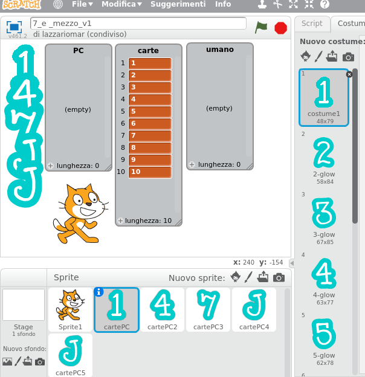

#. LO SPRITE CARTA ESEGUE LE SEGUENTI ISTRUZIONI:
  * ALL’INIZIO DEL GIOCO LA CARTA NON È VISIBILE
  * QUANDO VIENE ESTRATTA UNA CARTA VIENE INVIATO UN MESSAGGIO
  * AL PRIMO TURNO SOLO LA PRIMA CARTA (SE **CONTAT_CARTE=1**) SI MOSTRA CON IL COSTUME DEL NUMERO DELLA CARTA ESTRATTA.

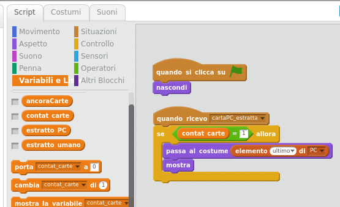
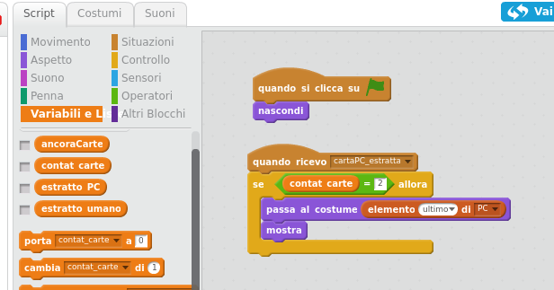

#. LE CARTE DEL GIOCATORE UMANO HANNO UN CODICE MOLTO SIMILE.
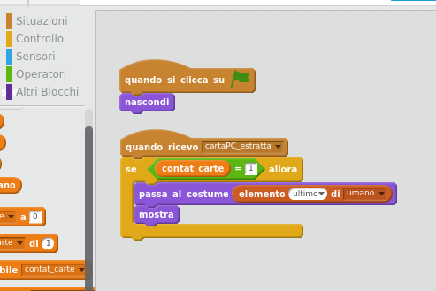
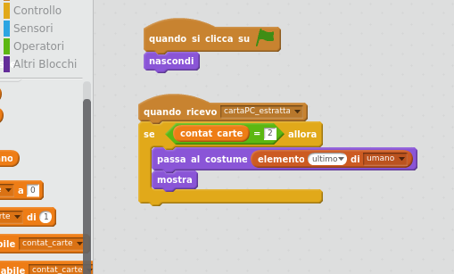
