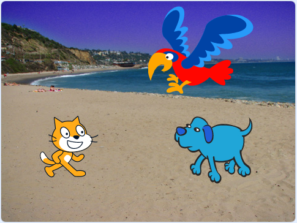
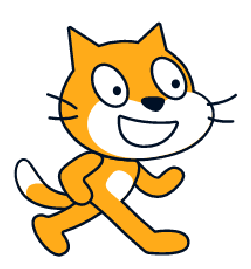
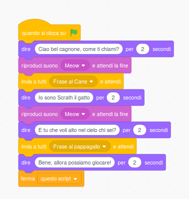
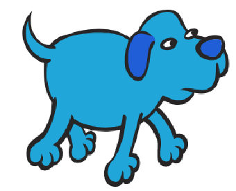
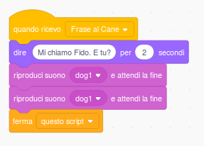
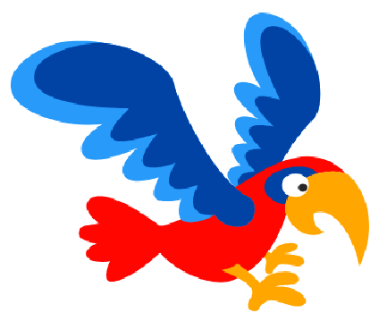
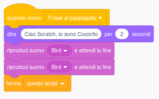

Conversazione con messaggio
===========================

Prerequisiti
------------

Saper distinguere le categorie a cui appartengono i blocchi.

Esercizio
---------

Tre sprite interagiscono tra di loro conversando.

Concetti di programmazione veicolati
------------------------------------

Gestione e scambio dei messaggi tra processi; gestione del suono.

**Soluzione**

Mediante l’invio di messaggi e la gestione dell’evento quando ricevo un messaggio è possibile far comunicare e interagire tra di loro gli sprite per ottenere tutta una serie di situazioni come, nel nostro caso, una conversazione a tre. La procedura va sincronizzata in modo da rendere più reale l’azione. Per la gestione dei suoni esistono dei blocchi che permettono di introdurre nel progetto suoni già registrati o di introdurne dei nuovi. 

**Gli script da progettare** sono i seguenti:

+----------------+----------------+
| Sprite         | Codice         |
+================+================+
| |image10|      |  |image11|     |
+----------------+----------------+
| |image20|      |  |image21|     |
+----------------+----------------+
| |image30|      |  |image31|     |
+----------------+----------------+

