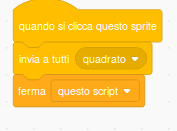
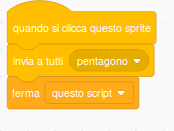

Poligoni regolari
==================

Prerequisiti
---------------

Saper disegnare con il computer (utilizzo di Paint): Scratch ha al suo interno uno strumento per disegnare simile a Paint
Saper cercare immagini da Internet
Conoscenza dei poligoni regolari, angoli e angoli supplementari.

Esercizio
------------
Utilizzare uno stage vuoto e cinque sprite: uno raffigurante una matita e altri quattro
raffiguranti i poligoni regolari triangolo, quadrato, pentagono ed esagono. Scopo
dell’esercizio è quello di far disegnare alla matita il poligono regolare su cui l’operatore
cliccherà con il mouse.

.. image:: ./images/poligoniRegolari/poligoniRegolari_img1.png

Concetti di programmazione veicolati
--------------------------------------------------

La sincronizzazione e la ripetizione.

**Soluzione**

.. image:: ./images/poligoniRegolari/poligoniRegolari_img2.png

.. image:: ./images/poligoniRegolari/poligoniRegolari_img3.png

Agganciare alle conoscenze di geometria sui poligoni regolari, sugli angoli interni a tali poligoni ed ai relativi angoli supplementari il concetto di ripetizione per un determinato numero di volte.
Ad esempio nel triangolo equilatero gli angoli interni (α) sono tutti di 60° quindi il relativo supplementare(β) è di 120°, quindi la matita che traccia un lato del triangolo per poter tracciare il lato successivo deve effettuare una rotazione di 120° cioè della misura dell’angolo supplementare.

.. image:: ./images/poligoniRegolari/poligoniRegolari_img4.png

Gli script da progettare sono i seguenti:

+----------------+----------------+
| Sprite         | Codice         |
+================+================+
| |image10|      |  |image11|     |
+----------------+----------------+
| |image20|      |  |image21|     |
+----------------+----------------+
| |image30|      |  |image31|     |
+----------------+----------------+
| |image40|      |  |image41|     |
+----------------+----------------+
| |image50|      |  |image51|     |
+----------------+----------------+
| |image60|      |  |image61|     |
+----------------+----------------+
| |image70|      |  |image71|     |
+----------------+----------------+
| |image80|      |  |image81|     |
+----------------+----------------+

.. |image10| image:: ./images/poligoniRegolari/icona_triangolo.png

.. |image81| image:: ./images/poligoniRegolari/bl_esagono.png

**Esercizio svolto**

`Link alprogetto ospitato sul sito di Scratch <http://scratch.mit.edu/projects/19841831/>`_

Variante
--------

L’informatico cerca sempre una soluzione che faccia un minor uso di istruzioni possibile.
Allora una soluzione interessante è quella di constatare che l’angolo supplementare nei poligoni regolari è uguale al risultato dell’operazione di 360 diviso il numero dei lati del poligono.
Per fare questo serve introdurre il concetto di variabile, ovvero di un contenitore che può contenere un valore, molte volte numerico ma non solo, che può cambiare nel tempo, man mano che le azioni si susseguono.
Servono per svolgere l’esercizio 2 variabili:
* una per contenere il numero dei lati del poligono che si desidera disegnare e che viene impostata dal click sul disegno di tale poligono
* l’altra per impostare il codice del colore con cui si vuole disegnare il poligono.

-- inserire tabella --

Attività da far svolgere
------------------------

Far generare alcuni poligoni con un numero superiore di lati. Attenzione sarà necessario diminuire la lunghezza del lato.

**Esercizio svolto**

`Link alprogetto ospitato sul sito di Scratch <http://scratch.mit.edu/projects/20098973/>'_
