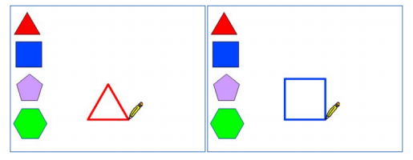
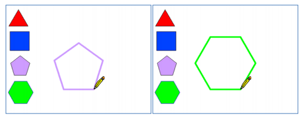

Poligoni regolari
==================

Prerequisiti
---------------

Saper disegnare con il computer (utilizzo di Paint): Scratch ha al suo interno uno strumento per disegnare simile a Paint
Saper cercare immagini da Internet
Conoscenza dei poligoni regolari, angoli e angoli supplementari.

Esercizio
------------
Utilizzare uno stage vuoto e cinque sprite: uno raffigurante una matita e altri quattro
raffiguranti i poligoni regolari triangolo, quadrato, pentagono ed esagono. Scopo
dell’esercizio è quello di far disegnare alla matita il poligono regolare su cui l’operatore
cliccherà con il mouse.

.. image:: ./images/poligoniRegolari/poligoniRegolari_img1.png

Concetti di programmazione veicolati
--------------------------------------------------

La sincronizzazione e la ripetizione.

**Soluzione**

Agganciare alle conoscenze di geometria sui poligoni regolari, sugli angoli interni a tali poligoni ed ai relativi angoli supplementari il concetto di ripetizione per un determinato numero di volte.
Ad esempio nel triangolo equilatero gli angoli interni (α) sono tutti di 60° quindi il relativo supplementare(β) è di 120°, quindi la matita che traccia un lato del triangolo per poter tracciare il lato successivo deve effettuare una rotazione di 120° cioè della misura dell’angolo supplementare.

.. image:: ./images/poligoniRegolari/poligoniRegolari_img4.png

Gli script da progettare sono i seguenti:

+----------------+----------------+
| Sprite         | Codice         |
+================+================+
| |image0|       |  |image1|      |
+----------------+----------------+

.. |image1| image:: ./images/poligoniRegolari/triangolo.png

