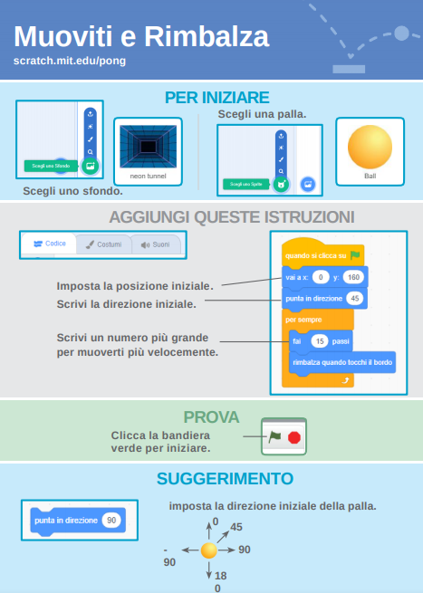
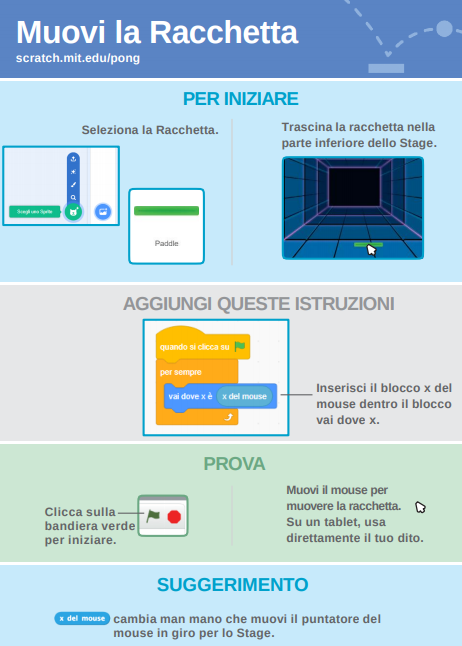
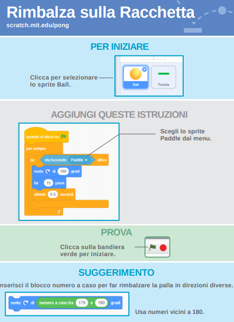
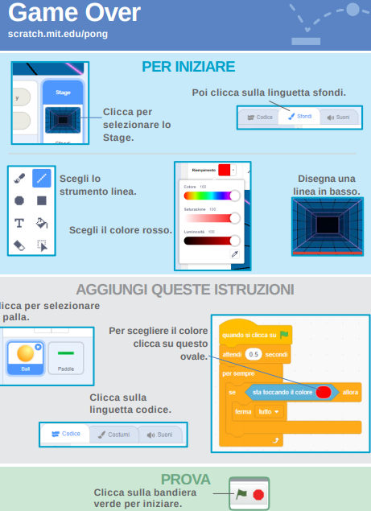
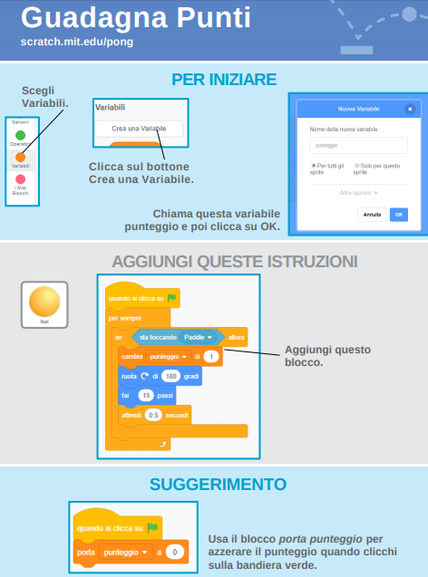
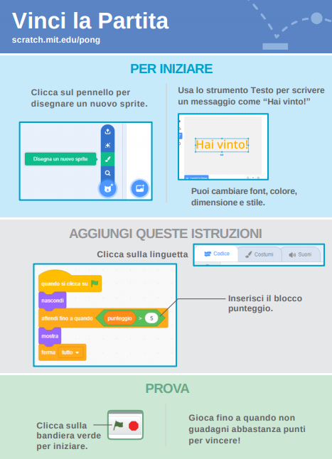
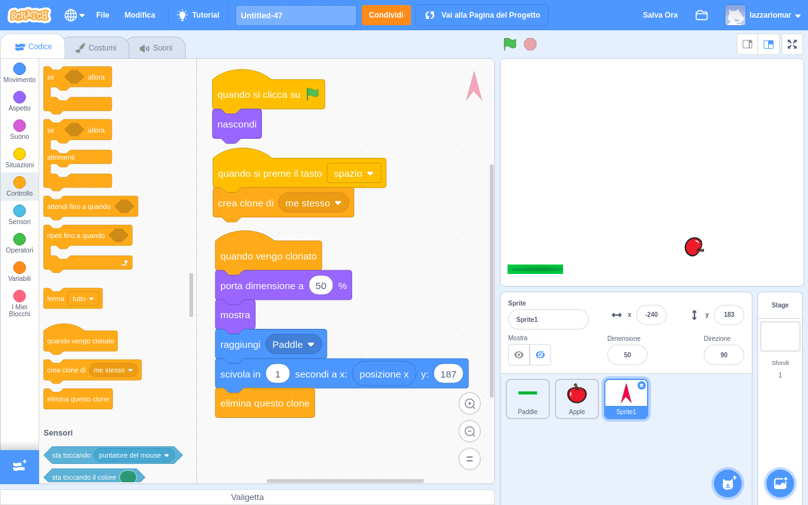
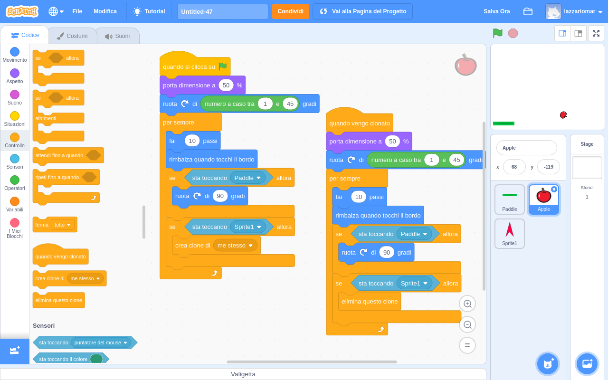

Gioco PONG
==========

.. contents:: Indice
  :depth: 1
  :local:

.. note::
 :download:`File .pdf del progetto <./file/pong_game_it.pdf>`
 Il file .pdf è presente anche `online a quest'indirizzo <http://scratched.gse.harvard.edu/resources/search/results/taxonomy%3A2499>`_
 `Guarda il progetto realizzato <https://scratch.mit.edu/projects/298295843/editor/>`_

Crea il gioco PONG base come descritto nel PDF sopra allegato
-------------------------------------------------------------

1. CREA LA **PALLINA**

2. CREA LA **RACCHETTA**

3. **RIMBALZA** SULLA RACCHETTA

4. CREA IL **GAME OVER**

5. CREA UN **PUNTEGGIO**

6. **VINCI** LA PARTITA

Modifica il gioco inventando nuove funzioni
-----------------------------------------------

7. LANCIA **PROIETTILI** DALLA NAVICELLA

8. **COLPISCI E CLONA** LA PALLA CON I PROIETTILI

9. CREA **OGGETTI DA RACCOGLIERE**

