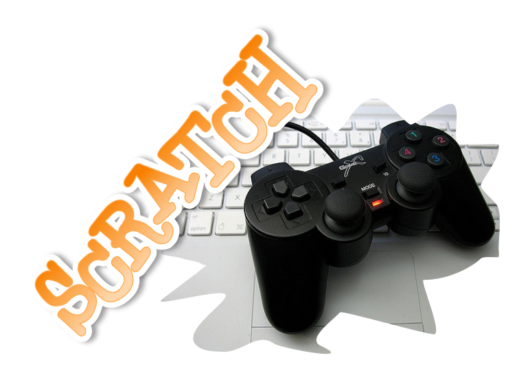
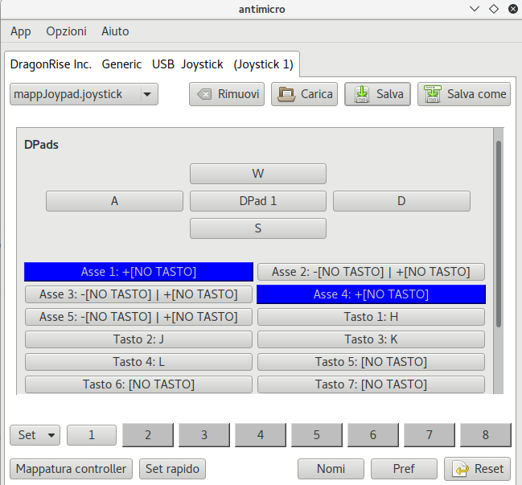

Come utilizzare un Joypad con Scratch
=====================================

È possibile utilizzare un joypad-usb per giocare Scratch?
**Ma certo!**

Serve un programma che emuli una tastiera convertendo i segnali del jpypad in lettere della tastiera.
Scratch non si accorgerà che sta ricevendo i tasti mediante l'uso di un joypad.
Abbinando i tasti freccia del joypad alle classiche lettere WASD potrai comandare gli eventi di Scratch.

Installazione di un software per la conversione
-----------------------------------------------
Come **prima cosa** devi installare un software che si occupi della conversione.

In Linux è disponibile questo programma tramite PPA:
 For 16.04 to 17.10 use this PPA
 sudo add-apt-repository ppa:mdeguzis/libregeek
 sudo apt-get update
 sudo apt-get install antimicro

e in Windows a questo `indirizzo Sourceforge <https://sourceforge.net/projects/antimicro.mirror/files/2.23/>`_.

Come **seconda cosa** devi aprire il programma e configurarlo; ricordati di lasciarlo in esecuzione in background.

